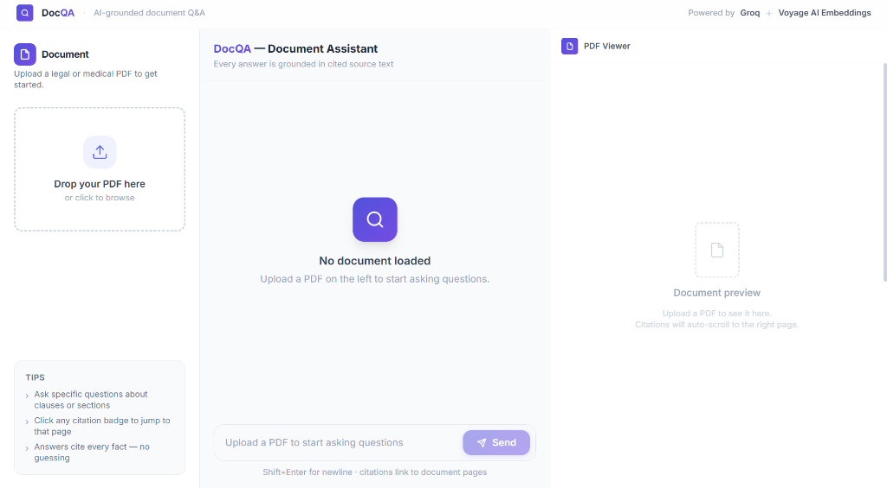

# DocQA — AI-Grounded Document Q&A

Upload a legal or medical PDF and ask questions about it. Every answer is grounded in cited source text — no hallucinated claims.


---

## 📸 Preview



---

## 🔗 Quick Links

| Service | Link / URL | Description |
|---|---|---|
| **Live Frontend App** | [https://doc-qa-document-assistant.vercel.app/](https://doc-qa-document-assistant.vercel.app/) | Next.js 16 interactive UI on Vercel |
| **Live Backend API** | [https://docqa-documentassistant.onrender.com](https://docqa-documentassistant.onrender.com) | FastAPI server hosted on Render |
| **Interactive API Docs** | [https://docqa-documentassistant.onrender.com/docs](https://docqa-documentassistant.onrender.com/docs) | Swagger UI API explorer |
| **API Specifications** | [https://docqa-documentassistant.onrender.com/redoc](https://docqa-documentassistant.onrender.com/redoc) | ReDoc API docs |
| **Health Check** | [https://docqa-documentassistant.onrender.com/health](https://docqa-documentassistant.onrender.com/health) | Backend health status endpoint |
| **GitHub Repository** | [kedarsoni04/DocQA-DocumentAssistant](https://github.com/kedarsoni04/DocQA-DocumentAssistant) | Source code repository |

---

## Architecture

```
User → Upload PDF → FastAPI /upload
         └─ PyMuPDF parse & structural chunk (with 200-char overlap)
         └─ Voyage AI embeddings (voyage-4-lite, asymmetric)
         └─ Chroma local vector store

User → Ask question → FastAPI /query
         └─ Embed query (Voyage AI, input_type="query")
         └─ Chroma dense retrieval (k=7)
         └─ Groq (qwen/qwen3.8-27b) strict grounding prompt → cited answer
         └─ Citation validation (auto-retry if [p.N] tags missing)

Frontend → Render answer with [p.N] citation badges
         └─ Click citation → pdf.js viewer scrolls to page
```

---

## Prerequisites

- Python 3.11+
- Node.js 18+
- A **Groq API key** ([console.groq.com](https://console.groq.com))
- A **Voyage AI API key** ([dashboard.voyageai.com](https://dashboard.voyageai.com))

---

## Setup & Running Locally

### 1. Clone

```bash
git clone https://github.com/kedarsoni04/DocQA-DocumentAssistant.git
cd DocQA-DocumentAssistant
```

### 2. Backend

```bash
cd backend

# Create and activate a virtual environment
python -m venv .venv
# Windows
.venv\Scripts\activate
# macOS/Linux
source .venv/bin/activate

# Install dependencies
pip install -r requirements.txt

# Configure API keys
cp .env.example .env
# Edit .env and fill in:
#   GROQ_API_KEY=gsk_...
#   VOYAGE_API_KEY=pa-...

# Start the server
uvicorn main:app --reload --host 0.0.0.0 --port 8000
```

The backend is now running at **http://localhost:8000**
Interactive API docs: http://localhost:8000/docs

### 3. Frontend

```bash
cd frontend

# Copy the environment file
cp .env.local.example .env.local
# (Edit if your backend is on a different port/host)

# Install dependencies
npm install

# Start the dev server
npm run dev
```

Open **http://localhost:3000** in your browser.

---

## API Keys Reference

| Key | Where | What for |
|-----|-------|---------|
| `GROQ_API_KEY` | `backend/.env` | Generation via Groq (`qwen/qwen3.8-27b`) |
| `VOYAGE_API_KEY` | `backend/.env` | Embeddings via Voyage AI (`voyage-4-lite`) |

> **Note on Free Tiers**: Voyage AI's free tier includes 200M tokens but is rate-limited to 3 RPM. Add a payment method on the Voyage dashboard to unlock standard rate limits.

> **Security**: Never commit your `.env` file. It is excluded by `.gitignore`.

---

## Environment Variables

### Backend (`backend/.env`)

| Variable | Default | Description |
|----------|---------|-------------|
| `GROQ_API_KEY` | *(required)* | Groq API key |
| `VOYAGE_API_KEY` | *(required)* | Voyage AI API key |
| `UPLOAD_DIR` | `uploads` | Local path for uploaded PDFs |
| `CHROMA_PERSIST_DIR` | `chroma_db` | Local path for Chroma data |
| `EMBEDDING_MODEL` | `voyage-4-lite` | Voyage AI embedding model |
| `GENERATION_MODEL` | `qwen/qwen3.8-27b` | Groq generation model |
| `GENERATION_TEMPERATURE` | `0.1` | Generation temperature (0–1) |
| `RETRIEVAL_K` | `7` | Number of chunks to retrieve |

### Frontend (`frontend/.env.local`)

| Variable | Default | Description |
|----------|---------|-------------|
| `NEXT_PUBLIC_API_URL` | `http://localhost:8000` | Backend base URL |

---

## Pipeline Details

### Ingestion (`backend/ingestion/`)

| Module | Responsibility |
|--------|---------------|
| `parser.py` | PyMuPDF text extraction; structural boundary chunking (numbered clauses, headings, roman numerals, ALL-CAPS headers); 200-char overlap between adjacent chunks; page-number preservation; min/max chunk size enforcement |
| `embedder.py` | Voyage AI embeddings (`voyage-4-lite`, `input_type="document"`) with retry logic; Chroma collection creation with full metadata |

Every chunk stores: `source_file`, `page_number`, `section_heading`, `chunk_index`, `text`.

### Query (`backend/query/`)

| Module | Responsibility |
|--------|---------------|
| `retriever.py` | Voyage AI query embedding (`input_type="query"`, asymmetric); Chroma cosine similarity search (k=7); returns ranked `RetrievedChunk` list |
| `generator.py` | Groq call with strict grounding system prompt + few-shot example; `[p.N]` citation enforcement with auto-retry validation; "not found" fallback |

### Citation System

- Groq is instructed: every factual sentence **must** end with `[p.<page_number>]`
- The system prompt includes a few-shot example of correctly cited output
- If the model omits citations, the generator **auto-retries once** with a stricter reminder appended; if citations are still absent, the answer is flagged as "Unverified"
- The frontend parses these tags with a regex and renders them as `<CitationBadge>` components
- Clicking a badge calls `PDFViewer.scrollToPage(n)` via React imperative handle
- The page renders in the pdf.js canvas with a brief indigo highlight flash

---

## Project Structure

```
rag-document-qasystem/
├── backend/
│   ├── config.py              # Pydantic-settings (reads .env)
│   ├── main.py                # FastAPI app
│   ├── voyage_api.py          # Voyage AI embedding client with retry
│   ├── ingestion/
│   │   ├── parser.py          # PDF parse & structural chunking (with overlap)
│   │   └── embedder.py        # Voyage AI embed + Chroma store
│   ├── query/
│   │   ├── retriever.py       # Dense retrieval (k=7)
│   │   └── generator.py       # Groq grounded generation
│   ├── requirements.txt
│   └── .env.example
├── frontend/
│   ├── app/
│   │   ├── layout.tsx         # Root layout (Inter font, metadata)
│   │   ├── page.tsx           # Three-panel main UI
│   │   └── globals.css        # Design system (Modern SaaS, indigo)
│   └── components/
│       ├── UploadPanel.tsx    # Drag-and-drop upload
│       ├── ChatPanel.tsx      # Chat thread + input
│       ├── MessageBubble.tsx  # Parses [p.N] → CitationBadge
│       ├── CitationBadge.tsx  # Clickable indigo citation pill
│       └── PDFViewer.tsx      # pdf.js viewer, scrollToPage
└── README.md
```

---

## Out of Scope (This Phase)

The following are explicitly deferred to future phases:
- Authentication / authorization
- Multi-document support
- Hybrid search / reranking
- Persistent database (documents currently survive only until server restart)
- Cloud deployment

---

## License

MIT
